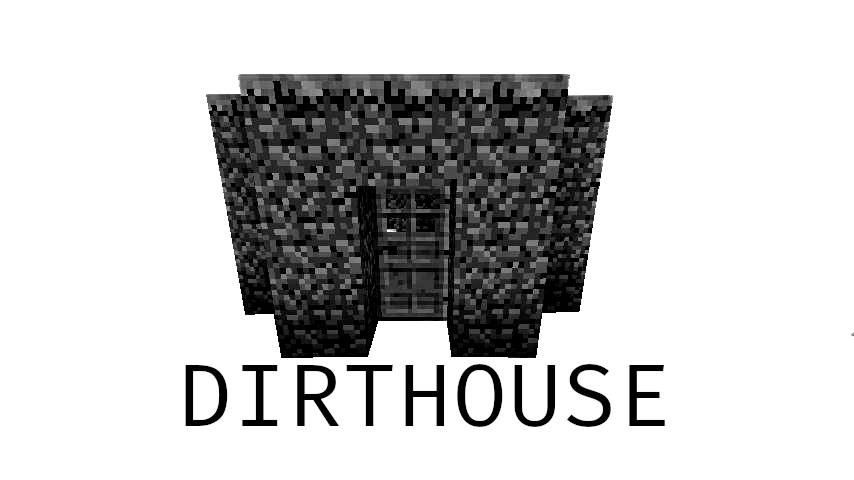

# 

## Foreword

> What if *php*, but **Rust**?

Remember Minecraft?? Back when you started out and you needed to survive the zombie attacks so you just built a pile of dirt and stayed inside through the night? 
Probably one of the most popular beginner strategies.

Which reminded me of another beginner approach: PHP (at least, that's where my professional career started, I got some ancient PHP websites running... somewhere)

Now I'm an adult, using adult languages, but sometimes I miss the insane and insecure approach of just having a script file that produced some HTML+JS using `echo`.

I was really debating whether this should have been done in JS or C# or Kotlin or maybe Python. I thought about switching to Python a million times.
But it turned out quite nice I think.

## DIRTHOUSE 

> Introducing DIRTHOUSE: Where coding meets the spirit of crafting a Minecraft dirt house! --ChatGPT

DIRTHOUSE is a weird tool that uses a weird document format `.rsr`, combining Rust and HTML markup and compiling into a [`actix_web`](https://docs.rs/actix-web/latest/actix_web) web server.
It's janky and unfinished, beyond the most basic usage.

Here's an example:

```html
<rust>
    use std::collections::HashMap;
    use actix_web::*;

    #[post("$route_print")]
    pub async fn print_string(body: String) -> HttpResponse {
        println!("{}", body);
        HttpResponse::Ok().finish()
    }

    pub async fn template(req: HttpRequest) -> HashMap<&'static str, String> {
        let conn_info = req.connection_info();
        let host = conn_info.host().to_owned();
        HashMap::from([
            ("title", host)
        ])
    }
</rust>
<!DOCTYPE html>
<html lang="en">
<head>
    <meta charset="UTF-8">
    <title>{{title}}</title>
</head>
<body>
<h1>{{title}}</h1>
<p>This is a test. The title displayed above should be like... your host name?</p>
</body>
</html>
```

Now there's a bit to unpack here and I'm not satisfied with it yet.
Firstly, see that `$route`? Yuck, it's a string literal that is replaced with the server's relative path to your `.rsr`-file.
Then there's the `template` function, it's special in that it is called in order to create some `serde`-deserializable data structure, 
which can then be used to fill out the template (`HashMap` was just the path of least resistance for this example). 
The template is rendered using the `handlebars`-crate.

That's about it for now.

I'll add some more documentation later :)

## Usage

Since `dirthouse` calls `cargo` multiple times from the shell, it is required to have Rust and Cargo installed beforehand. You can download and install those at https://rustup.rs/.

```
php-like web apps with Rust

Usage: dirthouse.exe <COMMAND>

Commands:
  build  Builds a new web app based on default or given configuration.
  help   Print this message or the help of the given subcommand(s)

Options:
  -h, --help  Print help
```

Here's an example JSON config:
```
{
  "app_name": "app",
  "serve_dir": "dist",
  "host_addr": "127.0.0.1",
  "port": 7642,
  "cleanup": true
}
```

Ideally you would run `dirthouse build` in a folder with your config.json file and a `serve_dir` containing your static files and your `.rsr`-files.
Then, a new `actix-web` app project folder is created with your implementation and compiled. The resulting binary is then ready to run from your current folder.
You can set the cleanup flag to true to delete the project folder after building. 
You can also use an absolute path for your `serve_dir` in your configuration, then your resulting app will always know where to serve your static files from.
The `.rsr`-files are embedded in your binary, so you can delete or move them, or just leave them be.

I think, down the line, that I would like dirthouse to have a watch-command that can continually rebuild your dirthouse app, but idk.
